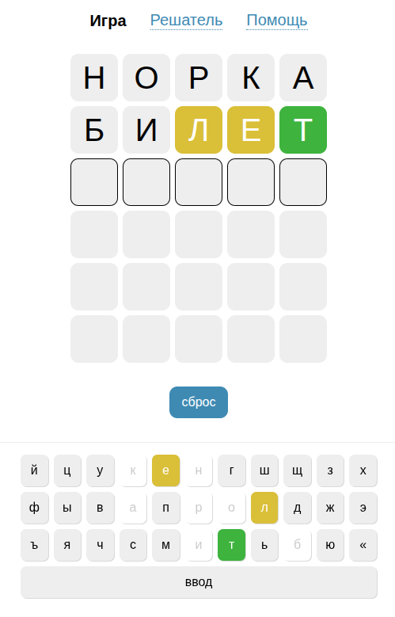
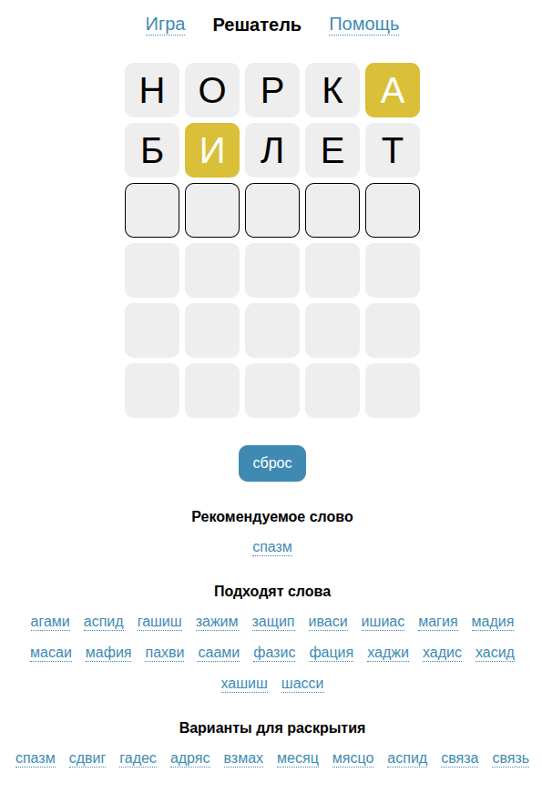

# Игра и решатель 5 букв (Wordle)

## Онлайн демо

https://alexbobrow.github.io/five-js/

## Правила игры
1. Загаданное слово состоит из 5 букв.
2. У вас есть 6 попыток, чтобы отгадать его.
3. После каждой попытки буквы подсвечиваются:
   * 🟩 Зелёный — буква стоит на правильном месте.
   * 🟨 Жёлтый — буква есть в слове, но в другом месте.
   * ⬜️ Серый — буквы нет в слове.
4. Используйте подсказки цветов, чтобы угадать слово за меньшее число ходов.



## Решатель
Позволяет подобрать загаданное слово на основе подсказок, которые даёт игра. Чтобы изменить цвет буквы, нажмите на неё,
или используйте пробел при вводе слова. После ввода слов и указания цветов букв, под словами появляются результаты
расчёта.



## Установка

Установите node и npm

```
git clone git@github.com:alexbobrow/five-js.git
cd vue-app
npm install
npm run dev
```

## Ссылки

* Источник словаря (4224 слова): [cwaterloo/5bukv](https://github.com/cwaterloo/5bukv)
* Оригинальная игра Wordle (англ.): [nytimes.com/games/wordle/](https://www.nytimes.com/games/wordle/index.html)
* Игра в Т-Банке: [5bukv.tbank.ru](https://5bukv.tbank.ru/)
* Игра на iOS на русском: [Словач](https://apps.apple.com/app/id1606970871) 
* Первоначальный вариант на Python: [github.com/alexbobrow/five-py](https://github.com/alexbobrow/five-py/)

